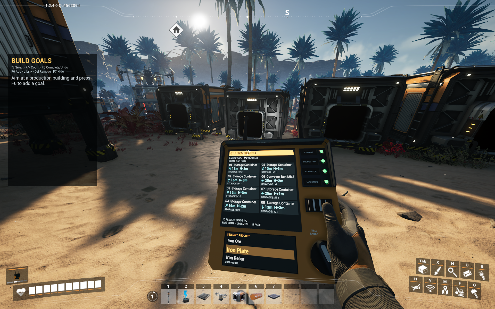
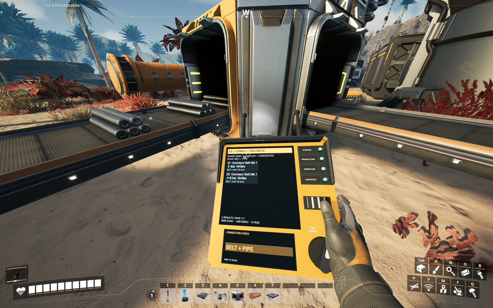

# Factory Scanner

Factory Scanner is a handheld Satisfactory equipment mod that combines an item radar with a conveyor and pipeline connection-gap checker.

The permanent mod reference and C++ module name are `ItemScanner`. The craftable in-game equipment and public mod name are **Factory Scanner**.

## Item Radar

## Connection Check

## Features

- Searches for a selected solid item in storage, production buildings, conveyors, and logistics actors.
- Shows eight results per page with live direction, distance, height difference, category, and quantity.
- Includes Item Radar and Connection Check modes.
- Detects compatible, disconnected belt or pipe endpoints facing each other within 0.5m, 1m, or 2m.
- Cycles Item Radar range through 100m, 300m, and 500m.
- Supports recipe-registered vanilla and compatible mod items while excluding build descriptors.
- Provides smooth accelerated product selection for long catalogs.
- Provides live first-person Pitch, Yaw, Roll, X, Y, Z, and Scale settings through the SML mod configuration page.
- Scans the world only after explicit input and then tracks cached results at 10Hz.

## Crafting

The Factory Scanner is automatically available in the Equipment Workshop.

- 1 Object Scanner
- 2 Rotors
- 2 Reinforced Iron Plates
- 20 seconds

## Controls

- Hold `Left Mouse Button`: open the radial control menu
- Release `Left Mouse Button`: select the highlighted option
- `Right Mouse Button`: scan or rescan
- `Shift + Mouse Wheel`: select products
- `R`: next result page

The radial menu controls the four item-search categories, scanner mode, radar range, and connection-gap distance.

## Compatibility

- Satisfactory build `502094` or newer within the compatible release
- Satisfactory Mod Loader `3.12.x`
- Windows client builds for Steam and Epic

Dedicated-server and final multiplayer support are not claimed until their release checks are complete.

## Source layout

- `Source/ItemScanner`: native mod implementation and automated tests
- `Content/Equipment`: meshes, materials, and scanner icon assets
- `Config`: runtime defaults and packaging settings
- `model/scanner2`: original scanner CAD sources
- `model/generated`: CAD conversion outputs and previews
- `Tools`: asset conversion, inspection, test, and deployment utilities
- `Docs`: implementation notes and public screenshots

Locally extracted Satisfactory reference assets, build products, backups, and development runtimes are intentionally excluded from version control.

## Build and verification

This repository is an SML plugin, not a complete Starter Project. Place it in `FactoryGame/Mods/ItemScanner` in the matching SML Starter Project and package it with Alpakit.

Internal version 0.3.10 was built for Steam and Epic Win64 Shipping on 2026-10-01. Thirteen `ItemScanner` automation tests passed. The final public 1.0.0 package still requires the in-game checks listed in `RELEASE_CHECKLIST.md`.

## Privacy and support

Factory Scanner does not collect telemetry or contact external services.

- Issues: https://github.com/AutoCrafter1223/factory-scanner/issues
- SMR description draft: `SMR_DESCRIPTION.md`
- Release checklist: `RELEASE_CHECKLIST.md`
